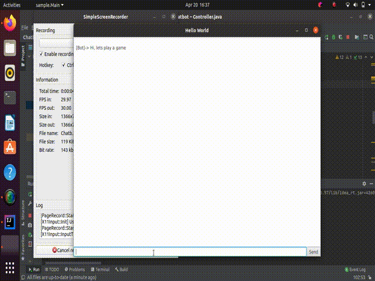

# Chatbot Java - Phase1

> This is a rudimentary chatbot game using Java, it is based on conditional logic i.e. 'if' stateents. This phase dose not use any NPL.

---

## Table of Contents

- [Description](#description)
- [Working](#working)
- [Inprovements](#inprovements)
- [Data Source](#data-source)
- [Author Info](#author-info)

---

## Description

This application is a game between the user and a bot. It is based on conditional statements, however the program will accpet different ways of affermative statements etc. I am using a data base that has the movie name and character name in a .txt file. The questions and answers are taken from here.

#### Technologies

- JavaIO
- JavaFx
- JavaNIO
- Basic Java

[Back To The Top](#Chatbot-Java--Phase1)

---

## Working

#### Data Base

  The file is a .txt file with involves 9,035 characters from 617 movies. 
  - character metadata included:
  	  - gender (for 3,774 characters)
	  - position on movie credits (3,321 characters)

  [Data File](Project/cornell movie-dialogs corpus/movie_characters_metadata.txt)

  -Data Pre-processing 
	
  The original delimiter used was ' +++$+++ '. This delimiter could not be used as the split function uses regular expressions, and could not accept this. The delimiter was changed to ';'

#### User Interface 
  The user interface is made using JavaFX. The top level is a BorderPane, we use the top, center and bottom of this view in the interface. 

  - Top

	  The top used and created in the controller, this is the only part of the interface that has not been coded in the fxml file. It is used to keep the score, and has a VBox in it for the user and bot scores. The TextFields are updated everytime the score changes through the contoler. 

  - Center 

	  The TextArea here isused for the conversation messages, it is appended here every time the bot or used sends a message.

  - Bottom

 	  Here a BorderPane is used with a TextField and  Button. 

#### Code
  The working is done in the [controller](Project/src/sample/Controller.java). Most of the events are trigered by sending a message(sendButton), from here various functions are called.

[Back To The Top](#Chatbot-Java--Phase1)

---

## Inprovements

The user experience can be further improved. This can be done by increasing the accpeted affermative and negative statements. Further we can also have multiple statemenst that the bot uses for correct or wrong answers in an array, this can then be randomly be used to create a better conversation. Lastly the UI can be improved to include shortcuts like 'Enter Button' to send. 

[Back To The Top](#Chatbot-Java--Phase1)

---

## Data Source

The data was taken from Kaggle and can be found [Here.](https://www.kaggle.com/fungusamongus/chatbot-data)

[Back To The Top](#Chatbot-Java--Phase1)

---

## Author Info

 - [Linkdin](www.linkedin.com/in/taher-mulla-8b9546136) 

 - [GitHub](https://github.com/taher-mulla)

 - Email - taher.mulla@gmail.co

[Back To The Top](#Chatbot-Java--Phase1)
